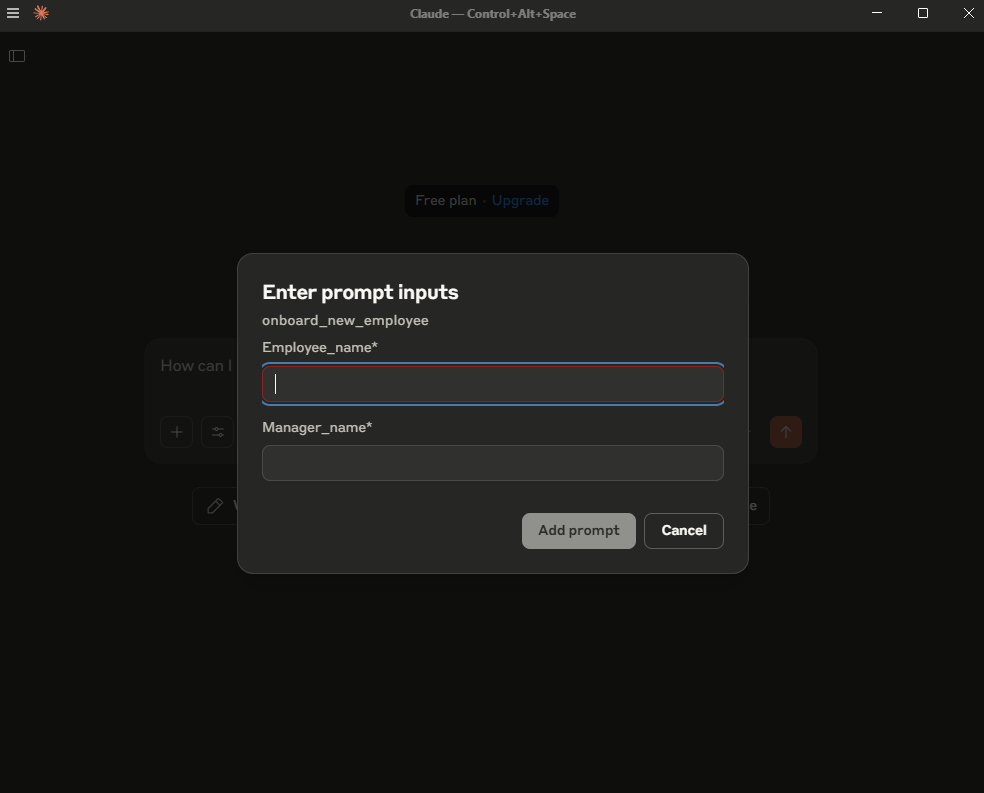
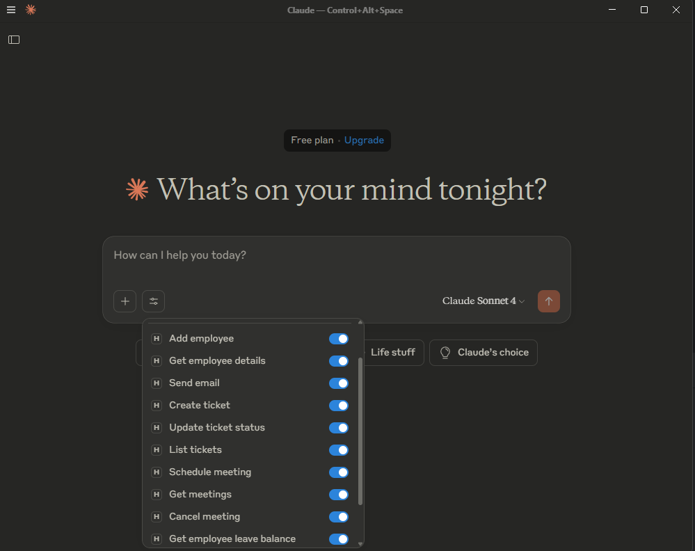
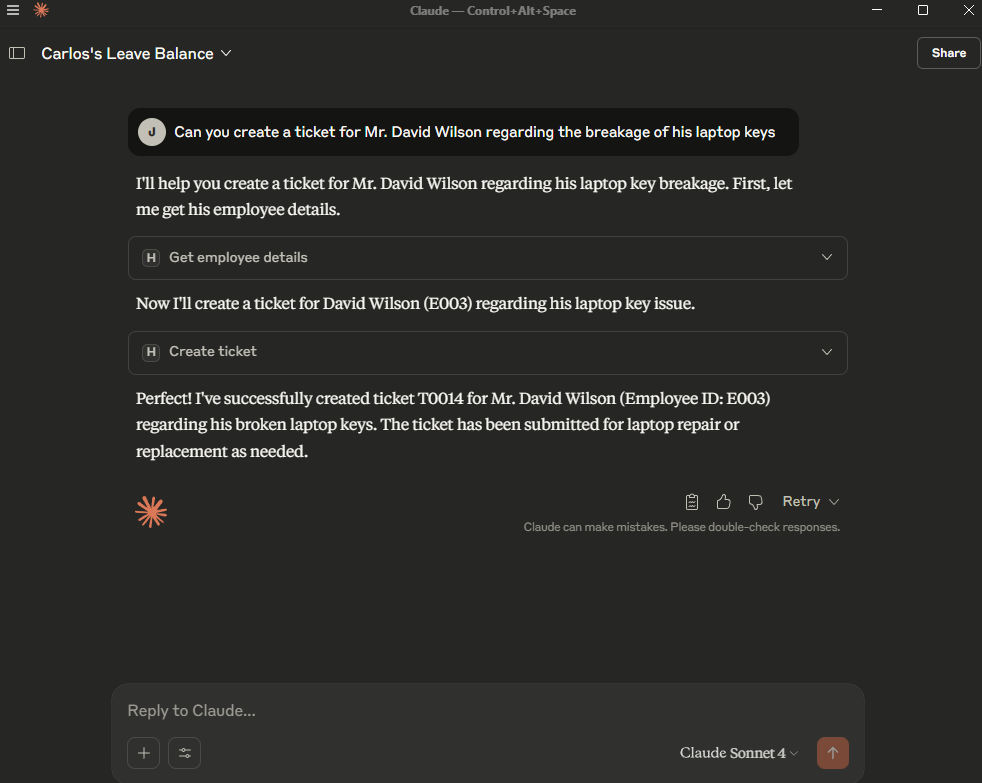
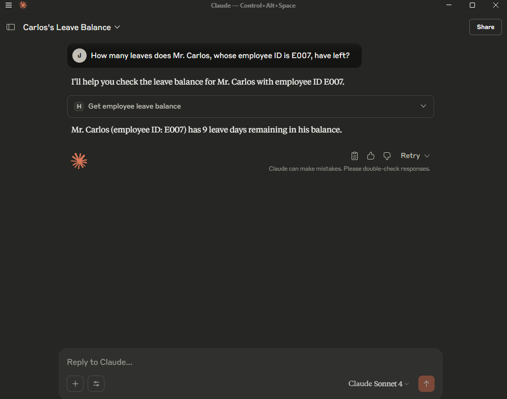

# Agentic HR Management System (MCP Integration)

A learning-oriented **Agentic AI HRMS** built as an **MCP server** and integrated with Claude Desktop.  
Manage employees, leaves, meetings, tickets, and onboarding — all via Claude.

  
  


---

## Screenshots

### Onboard Prompt


### HR Tools inside Claude


### Example Prompt #1


### Example Prompt #2


---

##  Features

-  **Employee Management** → add, search, reporting manager lookup  
-  **Leave Management** → apply for leave, view balance & history  
-  **Meeting Management** → schedule and cancel meetings  
-  **Ticket Management** → create, update, and track tickets  
-  **Automated Employee Onboarding Workflow**:
   - Send welcome email & credentials (mocked)
   - Notify reporting manager
   - Raise IT tickets (laptop, ID, access)
   - Schedule intro meeting

---

##  Project Structure

Each module simulates a microservice of the HRMS:

```bash
├── employee_manager.py   # Handles employee operations
├── leave_manager.py      # Handles leave requests, balances, and history
├── meeting_manager.py    # Manages meeting scheduling and cancellations
├── ticket_manager.py     # Creates, updates, and lists support tickets
├── utils.py              # Seeds dummy data into all services
├── server.py             # Main MCP server, exposes all tools/prompts
├── requirements.txt      # Necessary packages
└── README.md             # Project documentation 
```

---

## Installation & Setup:

1. Initialize the project (only once):
```bash
uv init hr_management_system
cd hr_management_system
```
2. Install dependencies:
```bash
uv pip install -r requirements.txt
```
3. Register the MCP server with Claude Desktop:
```bash
uv run mcp install server.py
```
4. Launch Claude Desktop — the HRMS tools will now be available.

---
## Future Enhancements
- Role-based access control
- Real email server integration
- Persistent database instead of in-memory storage
- Dashboard UI for HR managers